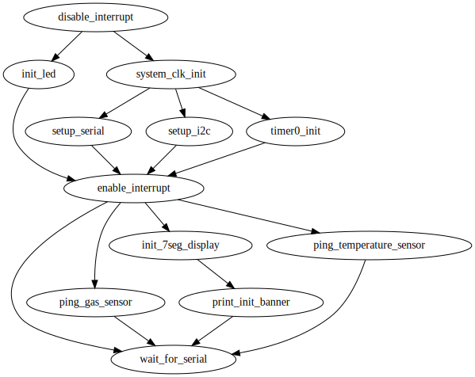

# Air quality sensor firmware in declarative C++

This project demonstrates how modern C++ (C++17 and beyond) is no longer just a
superset of C language. It is a declarative language capable of programming
bare-metal microcontrollers (MCUs) with zero runtime overhead. It also shows how
modern build systems like [Meson](https://mesonbuild.com) enables both model-in-the-loop testing, enabling
rapid design iterations.

## Architecture diagrams

### Runtime initialization dependency graph



### Device drivers dependency tree


## Highlights

### Declarative I2C command/query serialization & deserialization

The message communicated through I2C bus can be defined entirely in plain C-structs. For example,
the air quality sensor (ENS160) transmits the measurements via a 7-byte message in little-endian format, which can be defined declaratively as:

```c++
#pragma pack(push, 1)
struct AQIMeasurements {
    uint8_t aqi{};
    uint16_t tvoc{};
    uint16_t eco2{};
    uint16_t aqi500{};
};
#pragma pack(pop)
```

The main program can in turn request data through the I2C bus by

```c++
template<class Message, uint8_t i2c_addr>
Message read() {
    Message payload{};
    twi_readFrom(i2c_addr, reinterpret_cast<uint8_t*>(&payload), sizeof(Message), ...);
    return payload;
}

...
const auto [aqi, tvoc, eco2, _] = read<AQIMeasurement, 0x12>();
```

The direct mapping of the underlying I2C-serialized payload enables the compiler
to optimize the stack space/SRAM usage via return value optimization (RVO),
minimizing human error. Now, compare this to the following imperative code:

```c++
uint8_t buffer[7];
twi_readFrom(i2c_addr, buffer, 7, ...);
uint8_t aqi = buffer[0];
uint16_t tvoc = buffer[2];
tvoc <<= 8;
tvoc |= buffer[1];
...
```

### Compile-time dependency injection (DI)

All hardware drivers (e.g. sensors, timers, displays) are injected at compile
time using templated interfaces checked via C++20 Concepts. This enforces
architecture integrity at compile-time, and eliminates dynamic command dispatch
among drivers.

To understand the concept of compile-time DI, we need to unlearn C++98 and
imagine we are designing hardware in Verilog. For example, the LED blinking
driver has an internal register dictating the blink interval of the LED, so we
"synthesize" the register via the C++ keyword `static inline` as follows:
```c++
template<class led_pin>
struct Blinker {
    enum blink_interval_t :uint16_t { FAST=200, SLOW=1000};
    static inline blink_interval_t blink_interval{FAST};

    static constexpr void setMode(blink_interval_t bi) {
        blink_interval = bi;
    }

    // ... initialization and runtime logic...
};
```

Note the striking resemblance of the C++ class to the custom hardware written in
Verlog:
```verilog
module Blinker (
    parameter led_pin = 13
)(
    input logic clk,
    input logic set_mode, // Trigger to update the blink interval
    input logic [15:0] blink_interval    // New value
);
    logic [15:0] interval_reg;  // Internal register

    always_ff @(posedge clk) begin
        if (set_mode)
            interval_reg <= new_blink_interval; // Set on command
    end
endmodule
```

Now, the air quality sensor has a runtime initialization step that validates the
connection between the MCU and the sensor IC. We want the LED to blink fast when
the sensor is absent on the I2C bus, indicating boot error. In other words, the
`AirQualitySensor` driver should send a command `setMode` to the `Blinker`. We
can hook up the components `AirQualitySensor` and `Blinker` by:
```c++
// main.cpp
#include "components/blinker.hpp"
#include "components/air-quality-sensor.hpp"

namespace {

using HeartbeatIndicator = Blinker<13_pin>;
using AirQualitySensor_ = AirQualitySensor<HeartBeatIndicator, I2CPort>;
}
```
in which the templated class `AirQualitySensor<>` calls the `Blinker::setMode()`
commands statically. This pattern enables fully static call graphs at compiler
optimization level `-O3`, eliminating function pointers, virtual tables, and
other runtime overhead.

More hardware abstraction layers can be build on top of each other with zero
overhead. As shown in the component dependency tree below, the 7-segment display
driver abstracts out the underlying I2C commands sent to the HT16K33 device. And
the `rolling_display` component further abstracts out the finite state machine
that scrolls through various air quality measurements in a never ending cycle.
The top abstraction (`controllers::TheMainApp`) has a co-routine that
occasionally reads new measurements from the sensor via component
`AirQualitySensor`, and then updates the internal registers of the component
`rolling_display` via command `rolling_display::update(AQIMeasurements{...})`.


### Runtime initialization via static task dependency graph

The modern C++ code utilizes the [Intel Compile-time Init Build
(CIB)](https://github.com/intel/compile-time-init-build) framework to define the
MCU's boot sequence and the air-quality sensor's runtime initialization.
Internally, the CIB framework invokes the topological sorting algorithm to infer
the (single threaded) initialization steps based on the user-defined constraints.

For example, to ensure the MCU's system clock is set at 16MHz before enabling
interrupts, we can define the dependency declaratively via `sys_clock_init >>
enable_interrrupt`.

```c++
// components/core.hpp
struct CoreSystem {
    static constexpr auto sys_clock_init = flow::action([]() {
        CLKPR = 0x80;
        CLKPR = clockPrescaler<16_MHz>();
    });

    static constexpr auto enable_interrupt = flow::action([]() {
        sei();
    });

    constexpr static auto config = cib::config(
        cib::extend<RuntimeInit>(
            sys_clock_init >> enable_interrupt
            ));
};
```

Next, the blinking LED utilizes one GPIO port, so we can define the
initialization dependency as `setup_gpio >> CoreSystem::enable_interrupt`.

```c++
// component/blinker.hpp
template<class led_pin>
struct Blinker {
    static constexpr auto setup_gpio = flow::action([]() {
        // Enable output pins.
    });

    constexpr static auto config = cib::config(
        cib::extend<RuntimeInit>(
            sys_clock_init >> setup_gpio >> core::enable_interrupt
            ));
};
```

The air quality sensor IC is in turn initialized after I2C port is enabled, so
we define the dependency as `CoreSystem::enable_interrupt >>
AirQualitySensor::discover_sensor`.

The ultimate boot dependency graph can be generated directly from the modern c++
code by parsing all keywords `AAA >>> BBB` in the C++ files, as shown below:


### Modern build system

Meson is used as the primary build system, enabling:

- [X] 3rd party library (nested) dependency resolution and auto-download
- [X] native and cross compilation in the same build folder
- [X] On-device tests via TAP (Test Anything Protocol) over the UART interface.
- [X] Auto-flash and verify for on-target testing
- [X] Minimal incremental rebuild times

This enables seamless integration to the build validation servers and the
hardware testing servers.

### (To be continued) Model-in-the-loop testing

Compile-time validation is used extensively in the project. For example, it is known ahead of time that the I2C-serialized air quality measurements takes exactly 7 bytes. So we can assert for that by:

```C++
struct AQIMeasurements { ... };
static_assert(sizeof(AQIMeasurements) == 7);
```

Similarly, one can validate bit shifting logic at compile time, such as the big-endian to little-endian conversion code:
```c++
namespace big_endian{
struct UInt32 {...};

static_assert(UInt32{0xDEAD'BEEF}.as_uint16() == 0xEFBE'ADDE);
} // namespace big_endian
```

By building declarative models in modern C++, one can validate the business
logic off-target on the build machine. For example, the rolling air quality display is coded in state machine logic via Boost_SML:

```c++
template<class update_time, ...>
struct RollingDisplay {
    using namespace boost::sml;
    auto table = make_transition_table(
        *"Begin"_s + event<TimeMs> / update_time = "Init"_s,
        "Init"_s + event<TimeMs>[after_one_second] / (update_time, print_eco2_banner) = "eCO2Banner"_s,
        "eCO2Banner"_s + event<TimeMs>[after_one_second] / (update_time, print_eco2_value) = "eCO2Value"_s,
        "eCO2Value"_s + event<TimeMs>[after_one_second] / (update_time, print_tvoc_banner) = "TVOCBanner"_s,
        ...
    );
}
```

The state transition table can in turn validated by mock logic:
```c++
auto state_machine = RollingDisplay<mock_update_time, ...>{};
state_machine.process_event(0_ms);
REQUIRE(state_machine.is("Init"_s));
state_machine.process_event(1'000_ms);
REQUIRE(state_machine.is("eCO2Banner"_s));
```
